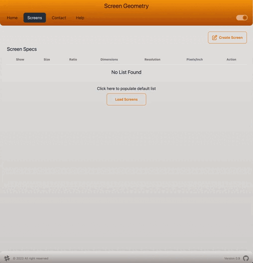

# Screen Geometry

   

## Description

This is a tool to help visually compare different screen sizes to help you choose which monitor, phone, or tablet to buy. It does this by overlaying different screen sizes ontop of each other for
easy comparison as well as tabulate the specs.

## Links

### Official App urls

The app is hosted in Cloudflare and is deployed from the main branch.

- Production [screengeometry.com](https://screengeometry.com)
- Develop [develop.screengeometry.com](https://develop.screengeometry.com)

### Reports

The reports are hosted in Github Pages and are deploed from the main branch.

- [Coverage](https://nader-eloshaiker.github.io/screen-geometry-app/coverage)
- [StoryBook](https://nader-eloshaiker.github.io/screen-geometry-app/storybook)

## App Demo

## Purpose

This app is more for show casing some **Dev Tooling**, **Web Dev Frame Works**, **Testing Practices** and **Automated Deployments**. However, as a bonus, it is a useful tool for _comparing different monitor screen configurations_.
I have been considering what my next monitor purchase will be and it has been difficult to conceptualise the different monitor sizes and aspect ratios when I only own a 27" - 16:9 monitor. So this app also has some utility outside of being a reference for frontend tech.

## How the user interacts with the App

1. Search > User has a search bar a list of preconfigured monitors that can be filtered by user text.
2. Creating a monitor configuration > User must enter at least, a monitor size and an aspect ratio to create a monitor entry.
3. Screen Configuration Table > User data is rendered onto a table. Table allows the user to "_Show/Hide_" a particular screen in the Physical Screen Comparison panel. Moving the mouse over or clinking each column will temporarily highlight the GUI panel and table row.
4. Screen GUI Panel > As user adds a screen configuration it will be displayed with a relative size to the others, allowing to compare screen realestate. Moving mouse over each screen panel, will temporarily highlight the screen outline and the respective table row. Screens that have been hidden, will not be visible in the Screen Comparison Panel.

[Read here](./docs/UserGuide.md) for a more detailed explaination

## Dev'ing the App

Installing dependencies

    npm install -g pnpm
    pnpm i

Run in development (using vite)

    pnpm run dev

Linting

    pnpm run lint:fix

Build (using vite)

    pnpm run build

Generate API Client\*\* (using orval)
Code is checked in for review ease. This can also help when working on a 'work in progress' published spec, as it allows the developer to control which spec the client is generated from in other feature branches and in main branches.

    pnpm run gen:spec

## Detailed Reading

- [Development tools and frameworks](./docs/Development.md)
- [Architecture](./docs/Architecture.md)
- [DevOps](./docs/DevOps.md)
- [GitOps](./docs/GitOps.md)
- [Testing](./docs/Testing.md)
