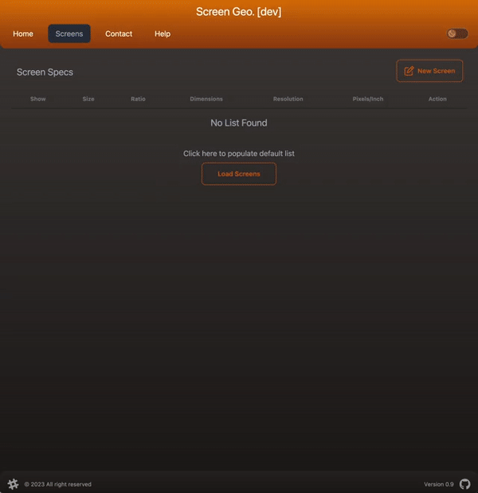
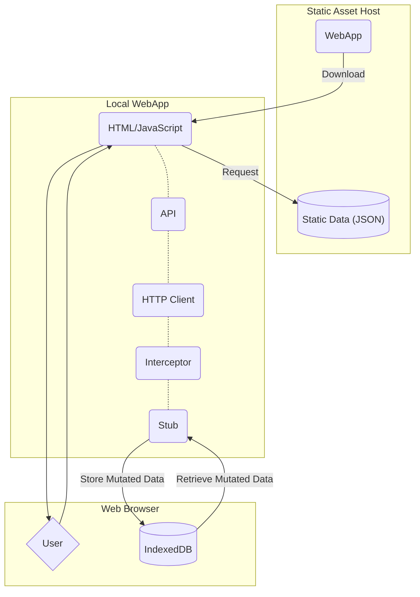

# Screen Geometry

Links

- [App URL (official)](https://screengeometry.com) Or [App URL (cloudflare pages)](https://screengeometry.pages.dev)
- [Stagging App URL (official)](https://stagging.screengeometry.com) Or [Stagging App URL (cloudflare pages)](https://stagging.screengeometry.pages.dev/)
- [Coverage](https://nader-eloshaiker.github.io/screen-geometry-app/coverage)
- [StoryBook](https://nader-eloshaiker.github.io/screen-geometry-app/storybook)

This is a tool to help visually compare different screen sizes to help you choose which monitor to buy. It does this by overlaying different screen sizes ontop of each other for
easy comparison as well as tabulate the specs.

## Purpose

This app is more for show casing some **Dev Tooling**, **Web Dev Frame Works**, **Testing Practices** and **Automated Deployments**. However, as a bonus, it is a useful tool for _comparing different monitor screen configurations_.
I have been considering what my next monitor purchase will be and it has been difficult to conceptualise the different monitor sizes and aspect ratios when I only own a 27" - 16:9 monitor. So this app also has some utility outside of being a reference for frontend tech.

## How the user interacts with the App

1. Search > User has a search bar a list of preconfigured monitors that can be filtered by user text.
2. Creating a monitor configuration > User must enter at least, a monitor size and an aspect ratio to create a monitor entry.
3. Screen Configuration Table > User data is rendered onto a table. Table allows the user to "_Show/Hide_" a particular screen in the Physical Screen Comparison panel. Moving the mouse over or clinking each column will temporarily highlight the GUI panel and table row.
4. Screen GUI Panel > As user adds a screen configuration it will be displayed with a relative size to the others, allowing to compare screen realestate. Moving mouse over each screen panel, will temporarily highlight the screen outline and the respective table row. Screens that have been hidden, will not be visible in the Screen Comparison Panel.

[Read here](./docs/UserGuide.md) for a more detailed explaination

## Dev'ing the App

Installing dependencies

    npm install -g pnpm
    pnpm i

Run in development (using vite)

    pnpm run dev

Linting

    pnpm run lint:fix

Build (using vite)

    pnpm run build

Generate API Client\*\* (using orval)
Code is checked in for review ease. This can also help when working on a 'work in progress' published spec, as it allows the developer to control which spec the client is generated from in other feature branches and in main branches.

    pnpm run gen:spec

## Architecture

This app generally follows a typical SPA (single page application) and access data from a backend using REST. However, given the simplicity of the app and its purpose, it does not require a fully fledged backend. This has lead to some unique design decisions.

- The host will serve not only the WebApp, but also, a JSON file containing a list of preconfigured popular screen configuration available to consumers.
- When the web browser executes the WebApp, on initialisation, it will fetch the JSON file as it would any other asset used by the app.
- This will then be used to pre-populate the search bar, allowing user to pick from a list of configurations rather than having to manually fill out the form.
- API calls are made for typical CRUD operations for the user configured screens.
- API calls are intercepted and routed to a frontend stub that runs in the browser as part of the WebApp
- The stub access the browser IndexedDB to persist the data

This approach literally is a **Serverless implementation** but also allow for a future enhancement for a real server to persist the user data without a major refactor of the frontend architecture.

Refer to the diagram below for a visual representation.

## Dev Tooling

### Orval

#### Description

Orval is a client API code generator. It takes an [OpenAPI or Swagger spec](https://swagger.io/specification/) (in yaml format) and generates not only the the endpoints complete with urls, but also the data models exchanged between client and server. You can read more here [orval.dev](https://orval.dev/) Note that there are many more tools such as one from Swagger themselves called [OpenAPI Tools](https://github.com/OpenAPITools/openapi-generator) and [Redux Toolkit OpenAPI code-generator](https://redux-toolkit.js.org/rtk-query/usage/code-generation). These are all very good tools, I just settled on this one because the generated code was easy to ready and allowed me to choose the underlying HTTP framework.

#### One source of truth

It is supremely accepted that the API spec is the only source of truth for the endpoint. It is the blueprint for the backend and it continually amazes me how little frontend developers refer to it. It is quite common to see human error in frontend API's due to referring to either word of mouth or Jira cards for the Endpoint spec, rather than referring the the OpenAPI/Swagger spec.

#### Reduced development time and effort

You are nolonger have to hand code all the api calls, just import the spec file and run the generator. Within seconds, you have all the api calls and the data models. You will also be assured that the models and urls are identical to the backend.
Another bonus is that you do not have to (and nor should you) write tests for the generated code, you just need to stub them as the generated code is already tested by the authors of the tool. Just remember to exclude it the folder containing the code from the linter, prettier, test runner, coverage reporter, etc.

#### Agile Development

Before starting frontend and backend engineers start development, it is encouraged that a 1 point card be created for the two engineers to sit down and hand craft the new or modified API together, referring to any design or wireframe guide. With the spec generated, this will allow the engineers to work in parallel on the feature, with the confidence that the end result will successfully integrate.

### Vite

I discovered this little gem to replace pnpm and it is lightning quick. You can read more about [Vite](https://vitejs.dev/), but to summarise what they have on their site for convenience:

- `Instant Server Start` On demand file serving over native ESM, no bundling required!
- `Lightning Fast HMR` Hot Module Replacement (HMR) that stays fast regardless of app size.
- `Rich Features` Out-of-the-box support for TypeScript, JSX, CSS and more.
- `Optimized Build` Pre-configured Rollup build with multi-page and library mode support.
- `Universal Plugins` Rollup-superset plugin interface shared between dev and build.
- `Fully Typed APIs` Flexible programmatic APIs with full TypeScript typing.

### Language

- ESlint
- Prettier
- PNPM
  - pnpm is up to 2x faster than npm
  - Files inside node_modules are cloned or hard linked from a single content-addressable storage
  - pnpm has built-in support for multiple packages in a repository
  - pnpm creates a non-flat node_modules by default, so code has no access to arbitrary packages

## Web Dev Frameworks

### Core

- TypeScript
  - This is such an important addition to JavaScript when generating code from an API Spec. Just remember that defining a `type` on an API response is ill advised, stick with `interface`.
  - Type safety may mean more code, but it also means less unit tests and more importantly, less bugs. I remember the days when your code will break unexpectedly due to a missing or incorrect prop!
- React
  - `<StrictMode>` :-(
  - Hooks
  - Functional Components
- React-Router-Dom
- React-Hook-Form
- YUP (Form Resolver)

### GUI

- Styled Components
- TailwindCSS
- DaisyUI
- StoryBook

### API

- Axios
- React-Query
- Orval
  - Orval allows the developer to choose which HTTP client is to be used as the underlying framework to actually make the fetch call, in this case React-Query with AXIOS
- localforage

## DevOps

### GitHub Actions Workflow

#### CI/CD

- PNPM cache management to store dependencies based on package lock hash
- Publish coverage report to PR and action output
- Run:
  - install
  - build production
  - lint
  - unit tests

#### Deplopyment

- build prod
- build storyblock docs
- build coverage
- build coverage badge
- deploy assets to GitHub Pages

## Testing

### Unit

Testing makes use of [Vitest](https://vitest.dev/) which is a test runner much like Jest but integrates with the Vite tranformation pipeline and configuration.
It provides a compatible api with Jest making it a drop in raplacement but runs significantly faster than Jest.

#### Run test

Initiating test runs and watching for changes is excuted using

    pnpm run test

However, you can bring up a visual console for testing using

    pnpm run test:ui

#### Test dashboard

The console can be accessed from the [http://localhost](http://localhost:51204/__vitest__/#/)
They are also published to github pages at 

#### Coverage Reports

Coverage reports are also generated and can be access from from within the testing console above

### Component

Storybook interactions is utilised to run a visual test on managed components.

### Smoke
