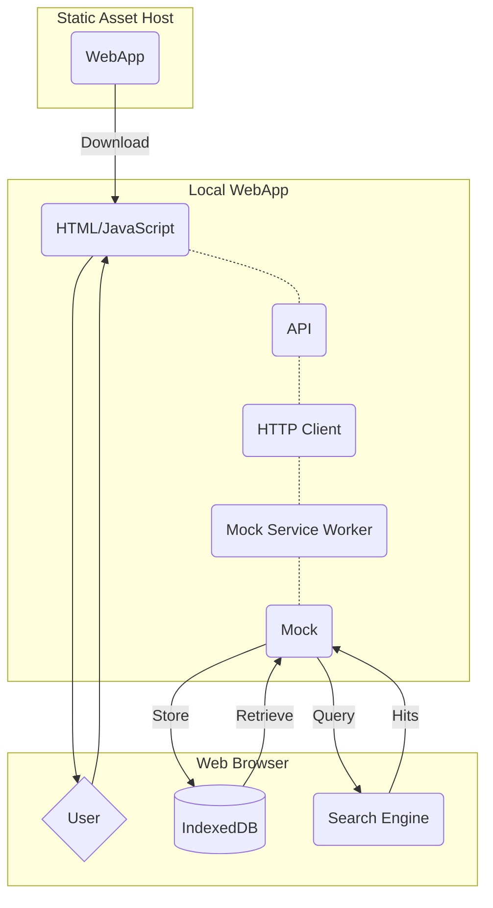

# Architecture

This app generally follows a typical SPA (single page application) and access data from a backend using REST. However, given the simplicity of the app and its purpose, it does not require a fully fledged backend. This has lead to some unique design decisions.

- API calls are made for typical CRUD operations for all the user generated content.
- API calls are intercepted and routed to a frontend mock service that runs in the browser as part of the WebApp using a [Mock Service Worker](https://mswjs.io/).
- The mock accesses the browser's IndexedDB to persist the data and an in-browser search engine.

This approach literally is a **Serverless implementation** but also allows for a future enhancement to implement a real server to search and persist the user data without a major refactor of the frontend architecture.

Refer to the diagram below for a visual representation.

