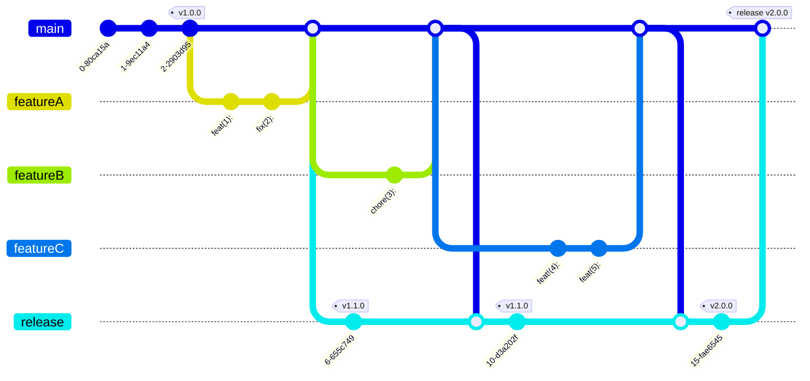

# GitOps

This git repo is hosted on [GitHub](https://github.com/) free account.

This repo uses [trunk based releasing](https://trunkbaseddevelopment.com) and so **THERE IS NO DEVELOP BRANCH**.

## Feature Branch

All changes are expected to be done using a feature branch and all commits must follow the semVer standard.

Every commit must be prefixed so that semVer can be generated for a release.

Release Please assumes you are using Conventional Commit messages.

The most important prefixes you should have in mind are:

- fix: which represents bug fixes, and correlates to a SemVer patch.
- feat: which represents a new feature, and correlates to a SemVer minor.
- feat!:, or fix!:, refactor!:, etc., which represent a breaking change (indicated by the !) and will result in a SemVer major.

## Main Branch | Default Branch

All merges to this branch must be done via a pull request.

On merge from feature, the release pr is either generated or if one exists, then it is updated according to the semVer and commit history. An accompanying tag is also generated in the pr.

When the release pr is merged to main, then a release is deployed to production.

All merges to this branch require **Tests Passed** and **CodeQL** statuses before they are able to proceed with the merge. This includes the release branches/prs.

## Workflow

